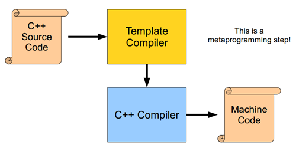
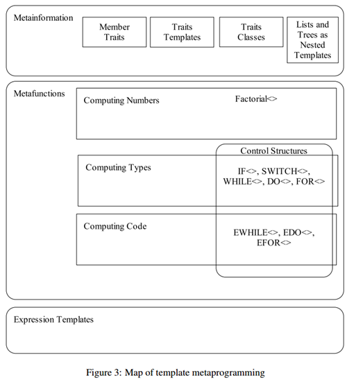

# C++模版的本质

作者 | Alex码农的艺术  责编 | 张文

----

**缘起：**

**这篇文章是在网上无意间看到的，我觉得总结得很好，放在这儿，看看自己的理解和文中所述有多少差别。**

---

C++的一些高级特性对于新人来说，很具有挑战性，而模板就是其中之一，晦涩语法让很多新人望而生畏；大多数人苦苦磨炼，却始终没有掌握这门绝学，本文通过揭开模板的一些面纱，希望帮助新人掌握模板的心法，从而学会这门武功（技术），助你跨过C++这座大山，向C++顶级程序员迈进，升职加薪；


## **C++模版的诞生** 

> 程序 = 数据结构 + 算法            
>
> ​                     ---Niklaus EmilWirth

程序本质是数据结构+算法，任何一门语言都可以这样理解，这个公式对计算机科学的影响程度足以类似物理学中爱因斯坦的“E=MC^2”——一个公式展示出了程序的本质。

最初C++是没有标准库的，任何一门语言的发展都需要标准库的支持，为了让C++更强大，更方便使用，Bjarne Stroustrup觉得需要给C++提供一个标准库，但标准库设计需要一套统一机制来定义各种通用的容器（数据结构）和算法，并且能很好在一起配合，这就需要它们既要相对的独立，又要操作接口保持统一，而且能够很容易被别人使用(用到实际类中），同时又要保证开销尽量小（性能要好）。Bjarne Stroustrup 提议C++需要一种机制来解决这个问题，所以就催生了模板的产生，最后经标准委员会各路专家讨论和发展，就发展成如今的模版， C++ 第一个正式的标准也加入了模板。

C++模版是一种解决方案，初心是提供参数化容器类和通用的算法（函数），目的就是为了减少重复代码，让通用性和高性能并存，提高C++程序员生产力。

### **什么是参数化容器类？**

首先C++是可以提供OOP（面向对象）范式编程的语言，所以支持类概念，类本身就是现实中一类事物的抽象，包括状态和对应的操作，打个比喻，大多数情况下我们谈论汽车，并不是指具体某辆汽车，而是某一类汽车（某个品牌），或者某一类车型的汽车。

所以我们设计汽车这个类的时候，各个汽车品牌的汽车大体框架（骨架）都差不多，都是4个轮子一个方向盘，而且操作基本上都是相同的，否则学车都要根据不同厂商汽车进行学习，所以我们可以用一个类来描述汽车的行为：

```cpp
class Car
{
public:
  Car(...);
  //other operations
  ...
private:
  Tire m_tire[4];
  Wheel m_wheel;
  //other attributes
  ...
};
```

但这样设计扩展性不是很好，因为不同的品牌的车，可能方向盘形状不一样，轮胎外观不一样等等。所以要描述这些不同我们可能就会根据不同品牌去设计不同的类，这样类就会变得很多，就会产生下面的问题：

- 代码冗余，会产生视觉复杂性，本身相似的东西比较多；
- 用户很难通过配置去实现一辆车设计，不好定制化一个汽车；
- 如果有其中一个属性有新的变化，就得实现一个新类，扩展代价太大。

这个时候，就希望这个类是可以参数化的（属性参数化），可以根据不同类型的参数进行属性配置，继而生成不同的类。类模板就应运而生了，类模板就是用来实现参数化的容器类。

### **什么是通用算法？**

程序=数据结构+算法

算法就是对容器的操作，对数据结构的操作，一般算法设计原则要满足KISS原则，功能尽量单一，尽量通用，才能更好和不同容器配合，有些算法属于控制类算法（比如遍历），还需要和其他算法进行配合，所以需要解决函数参数通用性问题。举个例子, 以前我们实现通用的排序函数可能是这样：

```javascript
void sort (void* first, void* last, Cmp cmp)；
```

这样的设计有下面一些问题：

- 为了支持多种类型，需要采用void*参数，但是void*参数是一种类型不安全参数，在运行时候需要通过类型转换来访问数据。
- 因为编译器不知道数据类型，那些对void*指针进行偏移操作（算术操作）会非常危险（GNU支持），所以操作会特别小心，这个给实现增加了复杂度。

所以要满足通用（支持各种容器），设计复杂度低，效率高，类型安全的算法，模板函数就应运而生了，模板函数就是用来实现通用算法并满足上面要求。

###  


### **C++模板的实现** 

C++标准委员会采用一套类似函数式语言的语法来设计C++模板，而且设计成图灵完备 (Turing-complete)（详见参考），我们可以把C++模板看成是一种新的语言，而且可以看成是函数式编程语言，只是设计依附在(借助于）C++其他基础语法上（类和函数）。




### **C++实现类模板（class template）技术** 

a. 定义模板类，让每个模板类拥有模板签名。

```cpp
template<typename T>class X{...};
```

上面的模板签名可以理解成：X<typename T>; 主要包括模板参数<typename T>和模板名字X（类名）， 基本的语法可以参考《C++ Templates: The Complete Guide》，《C++ primer》等书籍。

模板参数在形式上主要包括四类，为什么会存在这些分类，主要是满足不同类对参数化的需求:

- type template parameter: 类型模板参数，以class或typename 标记；此类主要是解决朴实的参数化类的问题（上面描述的问题），也是模板设计的初衷。
- non-type template parameter: 非类型模板参数，比如整型，布尔，枚举，指针，引用等;此类主要是提供给大小，长度等整型标量参数的控制，其次还提供参数算术运算能力，这些能力结合模板特化为模板提供了初始化值，条件判断，递归循环等能力，这些能力促使模板拥有图灵完备的计算能力。
- template template parameter，模板参数是模板,此类参数需要依赖其他模板参数（作为自己的入参），然后生成新的模板参数，可以用于策略类的设计policy-base class。
- parameter pack，C++11的变长模板参数,此类参数是C++11新增的，主要的目的是支持模板参数个数的动态变化，类似函数的变参，但有自己独有语法用于定义和解析（unpack），模板变参主要用于支持参数个数变化的类和函数，比如std::bind，可以绑定不同函数和对应参数，惰性执行，模板变参结合std::tuple就可以实现。

b. 在用模板类声明变量的地方，把模板实参（Arguments）（类型）带入模板类，然后按照匹配规则进行匹配，选择最佳匹配模板. 模板实参和形参类似于函数的形参和实参，模板实参只能是在编译时期确定的类型或者常量，C++17支持模板类实参推导。

c. 选好模板类之后，编译器会进行模板类实例化--即带入实际参数的类型或者常量自动生成代码，然后再进行通常的编译。


### **C++实现模板函数（function template）技术** 

模板函数实现技术和模板类形式上差不多：

```typescript
template<typename T>retType function_name(T t)；
```

其中几个关键点：

- 函数模板的签名包括模板参数，返回值，函数名，函数参数, cv-qualifier；
- 函数模板编译顺序大致：名称查找(可能涉及参数依赖查找)->实参推导->模板实参替换(实例化,可能涉及 SFINAE)->函数重载决议->编译；
- 函数模板可以在实例化时候进行参数推导，必须知道每个模板的实参，但不必指定每个模板的实参。编译器会从函数实参推导缺失的模板实参。这发生在尝试调用函数、取函数模板地址时，和某些其他语境中；
- 函数模板在进行实例化后会进行函数重载解析, 此时的函数签名不包括返回值(template  argument deduction/substitution)；
- 函数模板实例化过程中，参数推导不匹配所有的模板或者同时存在多个模板实例满足，或者函数重载决议有歧义等，实例化失败；
- 为了编译函数模板调用，编译器必须在非模板重载、模板重载和模板重载的特化间决定一个无歧义最佳的模板；


### **C++模板的核心技术 **

**SFINAE -Substitution failure is not an error** 

要理解这句话的关键点是failure和error在模板实例化中意义，模板实例化时候，编译器会用模板实参或者通过模板实参推导出参数类型带入可能的模板集（模板备选集合）中一个一个匹配，找到最优匹配的模板定义，

Failure：在模板集中，单个匹配失败；

Error：在模板集中，所有的匹配失败；

所以单个匹配失败，不能报错误，只有所有的匹配都失败了才报错误。

**模板特化**

模板特化为了支持模板类或者模板函数在特定的情况（指明模板的部分参数（偏特化）或者全部参数（完全特化））下特殊实现和优化，而这个机制给与模板某些高阶功能提供了基础，比如模板的递归（提供递归终止条件实现），模板条件判断（提供true或者false 条件实现）等。

**模板实参推导**

模板实参推导机制给与编译器可以通过实参去反推模板的形参，然后对模板进行实例化，具体推导规则见参考;

**模板计算**

模板参数支持两大类计算：

一类是类型计算（通过不同的模板参数返回不同的类型），此类计算为构建类型系统提供了基础，也是泛型编程的基础；
一类是整型参数的算术运算, 此类计算提供了模板在实例化时候动态匹配模板的能力；实参通过计算后的结果作为新的实参去匹配特定模板（模板特化）。

**模板递归**

模板递归是模板元编程的基础，也是C++11变参模板的基础。


### **C++模版的应用场景**

**C++ Library:**

可以实现通用的容器（Containers）和算法（Algorithms），比如STL，Boost等,使用模板技术实现的迭代器（Iterators）和仿函数（Functors）可以很好让容器和算法可以自由搭配和更好的配合;

**C++ type traits**

通过模板技术，C++ type traits实现了一套操作类型特性的系统，C++是静态类型语言，在编译时候需要对变量和函数进行类型检查，这个时候type traits可以提供更多类型信息给编译器， 能让程序做出更多策略选择和特定类型的深度优化，Type Traits有助于编写通用、可复用的代码。

**C++创始人对traits的理解：**

"Think of a trait as a small object whose main purpose is to carry information used by another object or algorithm to determine "policy" or "implementation details". - Bjarne Stroustrup

而这个技术，在其他语言也有类似实现，比如go的interface，java的注解，反射机制等。

**Template metaprogramming-TMP**



随着模板技术发展，模板元编程逐渐被人们发掘出来，metaprogramming本意是进行源代码生成的编程（代码生成器），同时也是对编程本身的一种更高级的抽象，好比我们元认知这些概念，就是对学习本身更高级的抽象。TMP通过模板实现一套“新的语言”（条件，递归，初始化，变量等），由于模板是图灵完备，理论上可以实现任何可计算编程，把本来在运行期实现部分功能可以移到编译期实现，节省运行时开销，比如进行循环展开，量纲分析等。

**Policy-Based Class Design**

C++ Policy class design 首见于 Andrei Alexandrescu 出版的 《Modern C++ Design》一书以及他在C/C++ Users Journal杂志专栏 Generic<Programming>，参考wiki。通过把不同策略设计成独立的类，然后通过模板参数对主类进行配置,通常policy-base class design采用继承方式去实现，这要求每个策略在设计的时候要相互独立正交。STL还结合CRTP （Curiously recurring template pattern）等模板技术，实现类似动态多态（虚函数）的静态多态，减少运行开销。

**Generic Programming(泛型编程）**

由于模板这种对类型强有力的抽象能力，能让容器和算法更加通用，这一系列的编程手法，慢慢引申出一种新的编程范式：泛型编程。泛型编程是对类型的抽象接口进行编程，STL库就是泛型编程经典范例。


### **C++模版的展望** 

**模版的代价**

没有任何事物是完美的，模板设计如此精良也有代价的，模板的代码和通常的代码比起来，

- **代码可读性差，理解门槛高。**一般人初学者很难看懂，开发和调试比较麻烦，对人员要求高，是跨越C++三座大山之一；
- **代码实现稳定性代价大。**对模板代码，实际上很难覆盖所有的测试，为了保证代码的健壮性，需要大量高质量的测试，各个平台（编译器）支持力度也不一样（比如模板递归深度，模板特性等），可移植性不能完全保证。模板多个实例很有可能会隐式地增加二进制文件的大小等，所以模板在某些情况下有一定代价，一定要在擅长的地方发挥才能；

如何降低门槛，对初学者更友好，如何降低复杂性，这个是C++未来发展重要的方向。现代c++正在追求让模板，或者说编译期的计算和泛型约束变简单，constexpr，concept，fold expression，还有C++ 20一大堆consteval，constinit，constexpr virtual function,constexpr dynamic cast,constexpr container等等特性的加入就是为了解决这些问题。曾经的递归变成了普通的constexpr函数，曾经的SFINAE变成了concept，曾经的枚举常量变成了constexpr常量，曾经的递归展开变成了fold expression，越来越简单，友好了。

**基于模板的设计模式**

随着C++模板技术的发展，以及大量实战的经验总结，逐渐形成了一些基于模板的经典设计，比如STL里面的特性（traits），策略（policy），标签（tag）等技法；Boost.MPL库（高级C++模板元编程框架）设计；Andrei Alexandrescu 提出的Policy-Based Class Design；以及Jim Coplien的curiously recurring template pattern (CRTP)，以及衍生Mixin技法；或许未来，基于模板可以衍生更多的设计模式，而这些优秀的设计模式可以实现最大性能和零成本抽象，这个也是C++的核心精神。

**模板的未来**

随着模板衍生出来的泛型编程，模板元编程，模板函数式编程等理念的发展，将来也许会发展出更抽象，更通用编程理念。模板本身是图灵完备的，所以可以结合C++其他特性，编译期常量和常量表达式，编译期计算，继承，友元friend等开阔出更多优雅的设计，比如元容器，类型擦除，自省和反射（静态反射和metaclass）等，将来会出现更多优秀的设计。